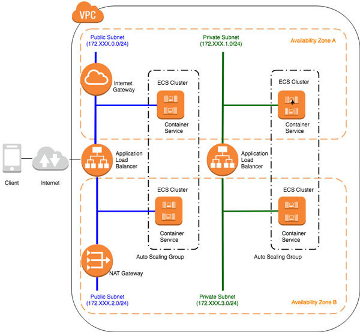

# AWS ECS上に構築するSpringアプリケーション

## 前提
以下ページを参考にAPI GatewayとLambdaを使用したspringアプリケーションを作成する。  
[AWS ECS上に構築するSpringアプリケーション](https://news.mynavi.jp/techplus/article/techp4354/)  
基本的に、上記のページをトレースするが、学習のため本ページにまとめる。

## AWS ECSの概要とアプリケーション環境構成
「Amazon Elastic Container Service (Amazon ECS)」は、クラスタ単位でDockerコンテナを簡単にスケーラブルかつ高速に実行／停止／管理できるコンテナ管理サービスである。

Linuxサーバ環境でDockerコンテナを単純に運用する場合と比較して、ECSではリージョン内の複数のアベイラビリティゾーンをまたいでコンテナを実行できるため、可用性の高い運用が可能。2019年1月時点では、1つまたは複数のEC2上にクラスタを構築し、その上に任意のレジストリにあるDockerイメージをデプロイする「EC2起動型」と、実行するクラスタ自体をマネージドとしてAWSが自動で管理し、コンテナだけを意識する「Fargate」に分類できる。

本稿では理解を深めるために、EC2クラスタ型でECSアプリケーションを構築するものとし、以下のようなイメージでECSアプリケーションを構築する形式とする。



## ECSアプリケーションの構築イメージ

作業はネットワーク環境の構築からアプリケーションの実装、コンテナイメージの作成、クラスタの実行など広範囲に及ぶので、以下の7つのステップに分けて解説を進めていく。

1. VPC (Virtual Private Cloud)環境の構築
2. アプリケーションロードバランサ (ALB)の作成
3. Springを使用したコンテナアプリケーションの実装方法
4. Dockerコンテナの作成・DockerHubへのプッシュ
5. ECSクラスタの作成
6. ECSタスクの定義
7. ECSサービスの実行

最初のステップでは、ALBやECSクラスタを配置するための、VPCおよびサブネットを構築する。具体的には、構築するVPC環境において、サブネットはパブリックとプライベートに分割し、可用性を考慮して、複数のアベイラビリティゾーンでECSコンテナが配置されるよう設定する。

サブネットをパブリックとプライベートに分割するのは、AWSではよく行われる構成で、次のような用途で構築される。

- パブリックサブネットはインターネットからのアクセスを受け付け、プライベートサブネットはVPC内からの接続のみ許可するようアクセス制御するため
- プライベートサブネットでは、DBへの接続や、オンプレミスとのVPNアクセスするサーバを配置し、セキュリティを向上させるため

ブラウザからのリクエストがメインのWebアプリケーションやモバイルアプリケーションなど、クライアントが多様化している昨今、ECSでアプリケーションを構成する場合は、次のような用途で、各サブネットに役割を分けてECSコンテナを配置するユースケースが発生する。

- パブリックサブネットにはBackend For Frontend (以下、BFF)として、Webアプリケーション向けのHTMLを生成するサーバなどを配置する
- プライベートサブネットのECSコンテナにAPIサーバを配置し、データベース接続などを行う

本連載では、こうしたユースケースを前提とした構成で、ECSアプリケーションを構築していく。なお、モバイル向けなど、シングルページアーキテクチャ(SPA)でアプリケーションを構成する場合、パブリックサブネットにはBFFアプリケーションの代わりに、「Amazon API Gateway」や「AWS AppSync」、「Kong」などのAPI Aggregationミドルウェアを設定する場合もある。2019年1月時点では、「Amazon API Gateway」のバックエンドにプライベートサブネット用のALBを介してECSコンテナを配置する構成はサポートされていないので、そうした構成をとりたい場合は、BFFサーバかKongなどのミドルウェアで代替する。

## AWS VPCの設定

1. **VPCダッシュボードに移動する**
    - メニューの「Services」をクリックし、「VPC」を検索または選択する。

2. **VPCを作成する**
    - VPCダッシュボードの左側のメニューで、「Your VPCs」をクリックする。
    - 「Create VPC」ボタンをクリックする。
    - 必要な情報（Name tag, IPv4 CIDR block等）を入力し、「Create」ボタンをクリックする。

3. **サブネットを作成する**
    - 左側のメニューで、「Subnets」をクリックする。
    - 「Create subnet」ボタンをクリックする。
    - 必要な情報（Name tag, VPC, IPv4 CIDR block等）を入力し、「Create」ボタンをクリックする。

4. **インターネットゲートウェイを作成＆アタッチする**
    - 左側のメニューで、「Internet Gateways」をクリックする。
    - 「Create internet gateway」ボタンをクリックする。
    - 必要な情報（Name tag等）を入力し、「Create」ボタンをクリックする。
    - 作成したインターネットゲートウェイを選択し、「Actions」ドロップダウンから「Attach to VPC」を選択し、対象のVPCを選択する。

5. **ルートテーブルを設定する**
    - 左側のメニューで、「Route Tables」をクリックする。
    - 新たにルートテーブルを作成するか、既存のルートテーブルを選択する。
    - 「Routes」タブを選択し、「Edit routes」をクリックする。
    - 「Add route」をクリックし、Destinationには0.0.0.0/0、Targetには作成したインターネットゲートウェイを選択する。「Save routes」をクリックする。
    - 「Subnet Associations」タブを選択し、「Edit subnet associations」をクリックする。作成したサブネットを選択し、「Save」をクリックする。

以上の手順に従って、AWS VPCの設定を行うことができる。

| パラメータ名 | 説明 |
|:-----------|:------------|
| Name tag | 作成するVPCや他のAWSリソース（サブネット、インターネットゲートウェイなど）に付ける名称。リソースを一意に識別するために使用する。|
| IPv4 CIDR block | VPC内のプライベートIPv4アドレス範囲を示す。CIDR表記法（例: `10.0.0.0/16`）で指定する。|
| VPC | サブネットやインターネットゲートウェイを関連付けるためのVPC。これらのリソースは作成時に特定のVPCに関連付けられる。|
| Destination | ルートテーブルに追加するルートの対象となるIPアドレス範囲。0.0.0.0/0を指定することで、すべてのIPアドレス範囲を表すことができる。|
| Target | ルートテーブルに追加するルートのターゲット。インターネットゲートウェイやNATゲートウェイなどのリソースを指定する。|

## AWS ALBの設定手順

1. AWS Management Consoleにログインし、「EC2」を選択する。

2. EC2ダッシュボードで、「Load Balancers」を選択する。

3. 「Create Load Balancer」をクリックする。

4. 「Load Balancer Type」で「Application Load Balancer」を選択し、「Create」をクリックする。

5. 「Configure Load Balancer」セクションで以下の設定を行う：
   - 「Load Balancer name」に適切な名前を入力する。
   - 「Scheme」でパブリックまたはインターナルのどちらかを選択する。
   - 「Listeners」セクションで、必要なポートとプロトコルを指定する。

6. 「Availability Zones」セクションで、ALBを配置するアベイラビリティーゾーンを選択する。

7. 「Security settings」セクションで、必要なセキュリティグループを選択する。

8. 「Configure Routing」セクションで以下の設定を行う：
   - 「Target group」で新しいターゲットグループを作成するか、既存のターゲットグループを選択する。
   - 必要に応じて「Path-based routing」や「Host-based routing」を構成する。

9. 「Register Targets」セクションで、ターゲットグループにターゲット（インスタンス、コンテナなど）を登録する。

10. 「Review」セクションで設定内容を確認し、「Create」をクリックする。

11. ALBが作成されたら、必要に応じてDNS名を使用してアプリケーションにアクセスできることを確認する。

以上で、AWS Management Consoleを使用してALBの設定が完了する。設定内容に応じてALBがトラフィックを受け取り、ターゲットグループに転送するように構成される。

| パラメータ名 | 説明 |
|:-----------|:------------|
| Name | 作成するALBの名称。この名前は、AWS内で一意でなければならない。 |
| Scheme | ALBの公開範囲を指定する。`internet-facing`はインターネットからアクセス可能なALBを、`internal`はVPC内部からのみアクセス可能なALBを作成する。 |
| Listeners | ALBが接続要求を受け入れるためのポートとプロトコルを指定する。HTTPおよびHTTPSが選択可能である。 |
| Availability Zones | ALBを配置するVPC内のAvailability Zoneと、それぞれに関連付けられるサブネットを指定する。 |
| Security groups | ALBに関連付けるセキュリティグループを指定する。これにより、ALBへのインバウンドトラフィックの許可/拒否を制御する。 |
| Target group | ALBがトラフィックをルーティングする対象の一覧。このグループには、リクエストを処理するEC2インスタンスなどが含まれる。 |
| Health checks | ALBがターゲットグループのヘルスチェックを実行するための設定。例えば、チェックするパスや、成功と判定するHTTPステータスコードなどを設定する。 |


## Springを使用したコンテナアプリケーションの実装方法
### pom.xmlの設定

- プライベートサブネット(Backend)アプリケーションのpom.xml

```
<dependencies>
  <dependency>
    <groupId>org.springframework.boot</groupId>
    <artifactId>spring-boot-starter-web</artifactId>
  </dependency>
</dependencies>
```

- パブリックサブネット(BFF)アプリケーションのpom.xml
```
<<dependencies>
  <dependency>
     <groupId>org.springframework.boot</groupId>
     <artifactId>spring-boot-starter-web</artifactId>
  </dependency>
  <dependency>
     <groupId>org.springframework.boot</groupId>
     <artifactId>spring-boot-starter-thymeleaf</artifactId>
  </dependency>
  <dependency>
    <groupId>org.springframework.boot</groupId>
    <artifactId>spring-boot-configuration-processor</artifactId>
    <optional>true</optional>
  </dependency>
</dependencies>
```

- org.springframework.boot:spring-boot-starter-web
この依存関係は、Spring BootによるWebアプリケーションの開発をサポートします。この依存関係を追加することで、Spring MVCなどのWebフレームワークを使用することが可能になる。

- org.springframework.boot:spring-boot-starter-thymeleaf
Thymeleafというテンプレートエンジンを使用するための依存関係です。Thymeleafは、HTMLテンプレートを処理し、動的なコンテンツを生成するための強力なツール。

- org.springframework.boot:spring-boot-configuration-processor (オプション)
Spring Bootの構成情報を処理するためのオプションの依存関係です。この依存関係を追加すると、アプリケーションの構成ファイルをより簡単に読み込み、解析することができる。

### アプリケーションの実装(backend)

- Backendアプリケーションのリクエストを受け付けるControllerクラス
プライベートサブネットでバックエンドAPIサーバとして、「/api/v1/users」というURLのパスでリクエストを受け取り、ユーザのリストを返却する簡単なアプリケーションを作成する。

```
package org.debugroom.mynavi.sample.ecs.backend.app.web;

import org.debugroom.mynavi.sample.ecs.backend.app.model.User;
import org.springframework.web.bind.annotation.GetMapping;
import org.springframework.web.bind.annotation.RequestMapping;
import org.springframework.web.bind.annotation.RestController;

@RestController
@RequestMapping("/api/v1")
public class BackendRestController {

    @GetMapping("/users")
    public List<User> getUsers(){
        List<User> users = new ArrayList<>();
        users.add(User.builder().userId("1").userName("Taro").build());
        users.add(User.builder().userId("2").userName("Jiro").build());
        return users;
    }
}
```

- BackendアプリケーションのSpirngBoot起動クラス

```
package org.debugroom.mynavi.sample.ecs.backend.config;

import org.springframework.boot.SpringApplication;
import org.springframework.boot.autoconfigure.SpringBootApplication;
import org.springframework.context.annotation.ComponentScan;

@SpringBootApplication
public class App {

    public static void main(String[] args) {
        SpringApplication.run(App.class, args);
    }

}
```


- BackendアプリケーションのWebMVC設定クラス

```
package org.debugroom.mynavi.sample.ecs.backend.config;

import org.springframework.context.annotation.ComponentScan;
import org.springframework.context.annotation.Configuration;
import org.springframework.web.servlet.config.annotation.WebMvcConfigurer;

@Configuration
@ComponentScan("org.debugroom.mynavi.sample.ecs.backend.app.web")
public class MvcConfig implements WebMvcConfigurer {
}
```


- application.yml
```
applicaiton.yml
server:
  servlet:
   context-path: /backend
```

### アプリケーションの実装(bff)

- bffアプリケーションのリクエストを受け付けるControllerクラス

```
package org.debugroom.mynavi.sample.ecs.backendforfrontend.app.web;

import org.springframework.beans.factory.annotation.Autowired;
import org.springframework.stereotype.Controller;
import org.springframework.ui.Model;
import org.springframework.web.bind.annotation.RequestMapping;
import org.springframework.web.bind.annotation.RequestMethod;
import org.springframework.web.client.RestOperations;

@Controller
public class BackendForFrontendController {

    @Autowired
    RestOperations restOperations;

    @RequestMapping(method = RequestMethod.GET, value = "users")
    public String getUsers(Model model){
        String service = "/backend/api/v1/users";
        model.addAttribute("users",
            restOperations.getForObject(service, User[].class));
        return "users";
    }
}
```
## Dockerコンテナ

- Backendアプリケーションのプロジェクトに作成するDockerfile

```
# Dockerfile for sample service using embedded tomcat server

# セキュリティと安定性のため、CentOS 7をベースにします
FROM centos:centos7

# メンテナの情報を記載します
MAINTAINER debugroom

# 必要なパッケージをインストールします: OpenJDK, wget, tar, iproute, git
RUN yum install -y \
       java-1.8.0-openjdk \
       java-1.8.0-openjdk-devel \
       wget tar iproute git

# Apache Mavenをインストールするためのレポジトリを追加します
RUN wget http://repos.fedorapeople.org/repos/dchen/apache-maven/epel-apache-maven.repo -O /etc/yum.repos.d/epel-apache-maven.repo

# レポジトリの設定を調整します
RUN sed -i s/\$releasever/6/g /etc/yum.repos.d/epel-apache-maven.repo

# Apache Mavenをインストールします
RUN yum install -y apache-maven

# 環境変数JAVA_HOMEを設定します
ENV JAVA_HOME /etc/alternatives/jre

# サンプルアプリケーションをcloneします
RUN git clone https://github.com/taiyakiyasan/tutorial-aws-ecs-app.git /var/local/mynavi-sample-aws-ecs

# pom.xmlを使ってMavenのインストールを行います
RUN mvn install -f /var/local/mynavi-sample-aws-ecs/pom.xml

# システムの時間設定を退避します
RUN cp /etc/localtime /etc/localtime.org

# システムのタイムゾーンを日本（Asia/Tokyo）に設定します
RUN ln -sf  /usr/share/zoneinfo/Asia/Tokyo /etc/localtime

# ポート8080を公開します
EXPOSE 8080

# 起動コマンドを設定します。ここではJavaのjarファイルを実行します
CMD java -jar -Dspring.profiles.active=production /var/local/mynavi-sample-aws-ecs/backend/target/mynavi-sample-aws-ecs-backend-0.0.1-SNAPSHOT.jar
```